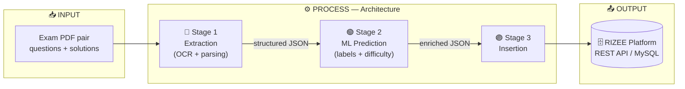

<h1 align="center">📄 PDF Extraction</h1>

<p align="center">
  <b>Exam-paper → structured, ML-enriched database records</b><br/>
  A three-stage pipeline that turns JEE Advanced / NEET PDF question papers into structured JSON,<br/>
  enriches them with ML-predicted labels, and inserts them into the RIZEE platform.
</p>

<p align="center">
  
  
  
  
  
  
</p>

---

## 📖 Overview

**PDF Extraction** is an automated pipeline that converts exam PDF question papers into structured, ML-enriched records ready for the RIZEE educational database.

| Stage | Input → Output | Engine |
|---|---|---|
| **1 — Extraction** | PDF pair (questions + solutions/key) → structured JSON | Mathpix OCR · LaTeX→MathML |
| **2 — Prediction** | Structured JSON → enriched JSON with ML labels | sentence-transformers + BERT |
| **3 — Insertion** | Enriched JSON → MySQL (direct) **or** RIZEE REST API | MySQL connector / HTTP |

---

## 🏗️ Architecture



Each stage hands a JSON artifact to the next, so any stage can be run independently from a saved file.

---

## 🧠 Stage 2 — Prediction Models

`inference.py` loads all models at import time (GPU if available, else CPU). `predict_with_subject(question_text, subject_hint)` is the single entrypoint.

| Model | File | Algorithm | Predicts |
|---|---|---|---|
| Embedder | *(downloaded)* | `all-mpnet-base-v2` | 768-d embedding |
| Chapter | `models/chapter.pkl` | LogisticRegression | `SUBJECT__CHAPTER` |
| Topic | `models/topic.pkl` + `topic_mlb.pkl` | OneVsRest LinearSVC | multi-label `SUBJECT__CHAPTER__TOPIC` |
| Concept | `models/concept.pkl` | LogisticRegression | theory concept |
| Exam | `models/exam.pkl` | LogisticRegression | `SUBJECT__EXAM` |
| Time | `models/time.pkl` | GradientBoostingRegressor | seconds |
| Type + Difficulty | `Brain/bert_multitask.pth` | BERT + 2 linear heads | question type, complexity |

> ⚠️ The `subject` string in extraction JSON must exactly match the training label prefix (`PHYSICS`, `CHEMISTRY`, `MATHEMATICS`). `model1.py` / `model2.py` are **training** scripts, not part of inference.

---

## 🚀 Running the Pipeline

### CLI — extraction + prediction + **API** insertion
```bash
# Single PDF pair
python api_main.py --questions "path/to/Q.Paper.pdf" --solutions "path/to/KEY & Sol'S.pdf" --exam JEE

# Batch (each sub-dir holds one *_Q.Paper.pdf + one *_KEY & Sol'S.pdf)
python api_main.py --input-dir "Input_PDFs/2022" --exam JEE

# Limit questions processed
python api_main.py --questions ... --solutions ... --exam NEET --limit 50
```

### CLI — extraction + prediction + **direct MySQL** insertion
```bash
python main.py --questions "path/to/Q.Paper.pdf" --solutions "path/to/KEY & Sol'S.pdf"
python main.py --input-dir "Input_PDFs/2022"
```

### FastAPI server (port 2244)
```bash
python api.py            # or
uvicorn api:app --host 0.0.0.0 --port 2244
```

---

## 🔌 Entry Points & Endpoints

| File | Insertion method | `--exam` |
|---|---|---|
| `main.py` | Direct MySQL | No |
| `api_main.py` | REST API | Yes (`JEE` / `NEET`) |
| `api.py` | REST API (FastAPI server) | Yes (form field) |

| Endpoint | Stages |
|---|---|
| `POST /adv-autoext` | extraction + prediction + API insertion |
| `POST /adv-extraction` | extraction only |
| `POST /adv-predict` | prediction only (upload extraction JSON) |
| `POST /adv-insertion` | API insertion only (upload prediction JSON) |

---

## ⚙️ Environment (`.env`)

```env
# Mathpix OCR
MATHPIX_APP_ID=...
MATHPIX_APP_KEY=...

# MySQL direct insertion
DB_HOST=...
DB_PORT=3306
DB_USER=...
DB_PASSWORD=...
DB_NAME=...

# ID-mapping JSON files (exam.json, subjects.json, Chapters.json, Topics.json, …)
MAPPING_DIR=/path/to/mapping/

# Optional output overrides
ADVANCE_OUTPUT_DIR=/path/to/PDF_Outputs
ADVANCE_MATHPIX_CACHE_DIR=/path/to/Mathpix_Cache
```

---

## 🧰 Tech Stack

| Layer | Technologies |
|---|---|
| **OCR / Parsing** | Mathpix · `latex2mathml` · regex · perceptual-hash footer matching |
| **ML** | sentence-transformers (`all-mpnet-base-v2`) · scikit-learn · BERT (PyTorch) |
| **API** | FastAPI · Uvicorn |
| **Storage** | MySQL · RIZEE REST API |

---

<p align="center">
  <a href="https://www.linkedin.com/in/abbunitheesreddy/"></a>
  <a href="https://github.com/AbbuNitheesReddy"></a>
  <a href="mailto:nithish.7098@gmail.com"></a>
</p>
<p align="center"><i>Built by Abbu Nithees Reddy</i></p>
